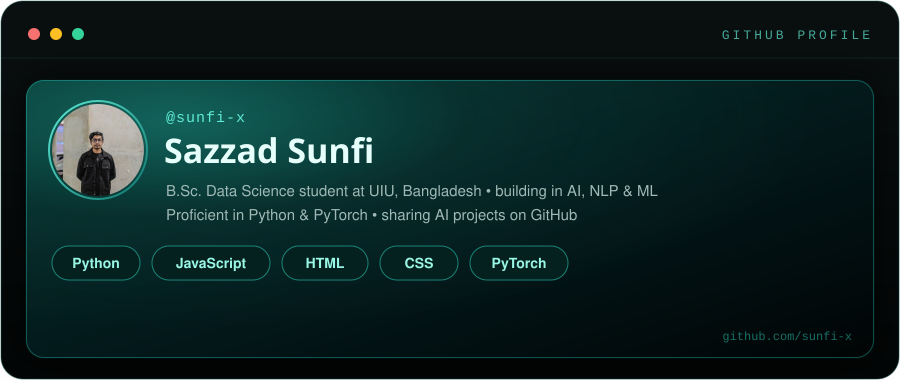

# 

 

 

## 🧠 About Me

- 🎓 B.Sc. in Data Science student at **United International University (UIU)**, Bangladesh
- 🤖 Passionate about **AI**, **NLP**, and **Machine Learning**
- 🐍 Proficient in **Python**, **PyTorch**, and **JavaScript**
- 🌱 Exploring applied ML systems and shipping side projects on GitHub
- 📫 Reach me via issues, discussions, or email: [sunfisazzad@gmail.com](mailto:sunfisazzad@gmail.com)

 

## 🛠️ Tech Stack

 

## 📊 GitHub Stats

 

 

 

## 📈 Contribution Activity

 

<picture>
  <source media="(prefers-color-scheme: dark)" srcset="https://github.com/sunfi-x/sunfi-x/raw/output/github-contribution-grid-snake-dark.svg">
  <source media="(prefers-color-scheme: light)" srcset="https://github.com/sunfi-x/sunfi-x/raw/output/github-contribution-grid-snake.svg">
  
</picture>

 

## 🌟 Featured Projects

| Repository | Description |
|------------|-------------|
| 🔍 **[UIU_Lost_and_Found_V3.0](https://github.com/sunfi-x/UIU_Lost_and_Found_V3.0)** | An AI-powered Lost and Found Management System for the United International University (UIU) campus, featuring automated matching and robust analytics. |
| 🚀 **[Shuttle-Flow](https://github.com/sunfi-x/Shuttle-Flow)** | A lightweight ETL pipeline orchestration platform optimized for ML workflows, easily deployable to Kubernetes environments. |
| 🧬 **[PCOS Prediction via ML](https://github.com/sunfi-x/Machine-Learning-Based-Prediction-of-Polycystic-Ovary-Syndrome-PCOS-)** | End-to-end ML model for Polycystic Ovary Syndrome diagnosis, complete with data preprocessing, feature engineering, and high accuracy reporting. |
| 📊 **[Data Science Job Market 2025](https://github.com/sunfi-x/Data-Science-Job-Market-Analysis-in-Bangladesh-2025)** | Comprehensive data scraping, cleaning, and visualization pipeline analyzing LinkedIn to forecast data science job market trends in Bangladesh. |
| 🛒 **[Yato-Store-BD](https://github.com/sunfi-x/Yato-Store-BD)** | A full-stack E-commerce platform architecture showcasing scalable database design, modern front-end framework integration, and robust API endpoints. |

 

## 📫 Connect with Me

---

<!-- Auto-generated profile README -->
